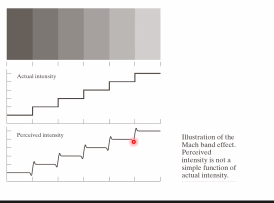
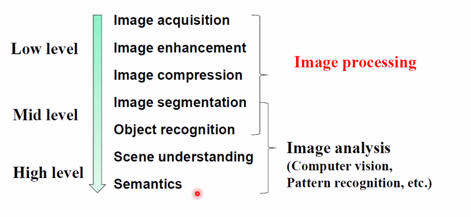
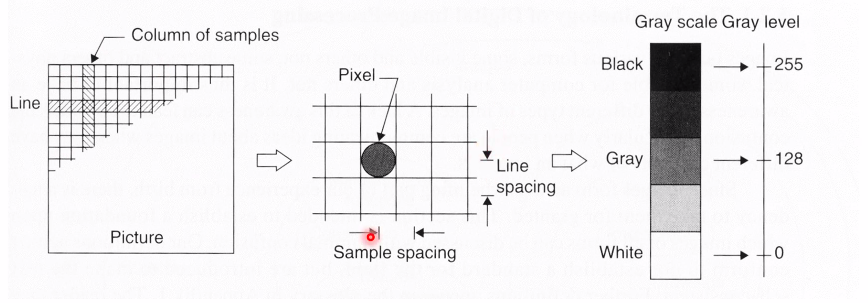
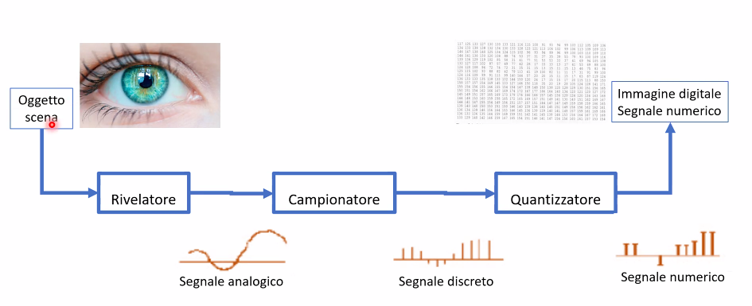
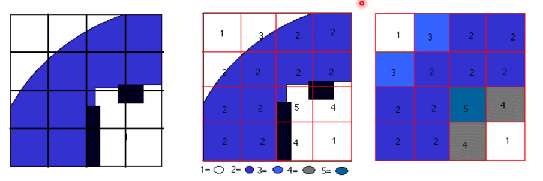
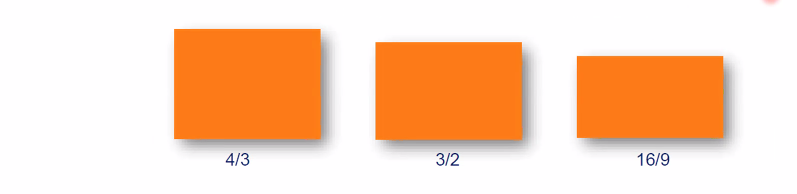
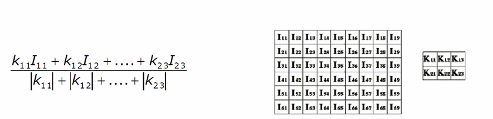
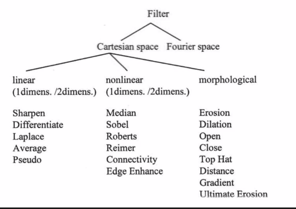
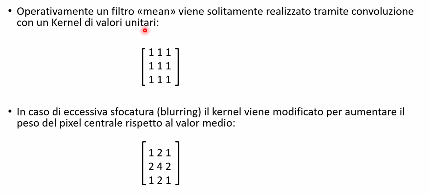
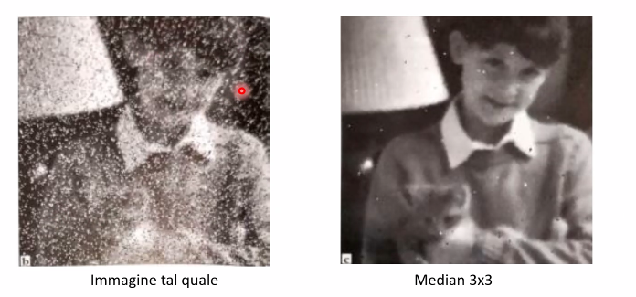

# Image J Seminar
Immagine:
- Rappresentqzione didimensionale secondo coordinate spaziali indipendenti di un'entità fisica relativa d un oggetto o a una scena
- Funcione di due o tre varibiali reali L(x,y) o L(x,y,z) dove L rappresenta l'entità fisica (es. intensità luminosa) di ciascun punto di un piano o di un volume di intersse identificato con coordinate x,y o x,y,z

Immagine digitale (definizione funzionale):
- Matrice di pizel quadrati or rettangolari organizzati in righe e colonne (matrice tridimensionale e voxel nel caso di immagini tridimensionali)

Image processing:
- Lo studio di qualsiasi algoritmo che ha come input un'immagine digitale e restituisce a sua volta un'immagine digitale o informazioni estratte dall'immagine originale
- Include le seguenti operazioni:
	- visualizzazione e stampa
	- editing e manipolazione di immagini (image editing)
	- correzione di immagini (image restoration)
	- miglioramento di immagini (image enhancement)
	- identificazione di caratteristiche di interesse (feature detection)
	- compressione di immagini (image compression)

Image formation: object in -> image out  	 
Image processing: image in -> image out		 
Image analysis: image in -> features out	 

Computer graphics: numeri in -> image out
Computer vision: image in -> interpretation out
Visualization: image in -> representation out

Un'immageine viene rappresentata come una matrice di pixel, dove ogni pixel è un numero che rappresenta un colore.

Perchè elaborare e analizzare immagini?
- Realizzare immagini accattivanti, efficaci, informative (image processing)
	- Pubblicazioni, presentazioni, siti web, social 
- Estrarre informazioni qualitative e quantitative da immagini (image analysis)
	- Misurazioni dimensionali, conteggi, livelli di attività
- Rendere possibili test e attività sperimentali (automation)
	- Sequenziamento genomico, identificazione di nuove galassie, automazione industriale, controllo di qualità di linea
- Adottare un approccio oggettivo e riproducibile (science)
	- Essenziale per un processo scientifico

Percezione umana e limiti:
Il nostro sistema visivo non vede tutto lo spettro elettromagnetico, ma solo una piccola parte (400-700 nm).

- Occorre quindi convertire segnali ottenuti tramite radiazioni elettromagnetiche non visibili all'occhio umano in rappresentazioni nello spettro del visibile.
- Perché è possibile analizzare immagini ottenute da segnali differenti dalle radiazioni elettromagnetiche

Perchè il sistema di visione e percezione umano non permette sempre valutazioni affidabili.
La retina include due fotorecettori:
- Coni: localizzati nella fovea, altamente sensibili al colore, non lavorano a bassi livelli di illuminazione 
- Bastoncelli: localizzati altrove, contribuisco alla percezione del contest, sono incapaci di distinguere il colore, lavorano anche a bassi livelli di illuminazioneIl sistema di visione e percezione umano non permette sempre valutazioni affidabili.

II segnale relativo all'intensità luminosa raccolta dai singoli fotorecettori deve venire elaborato (localmente e dal cervello) per bilanciare gli effetti dovuti ai tessuti sovrastanti che assorbono frazioni non trascurabili di luce.

Il sistema di visione e percezione umano:
- è limitato alle lunghezze d'onda comprese fra 380 e 700 nm, con una maggiore sensibilità intorno ai 550 nm;
- riesce a discriminare poco più di un centinaio di gradazioni di grigio (intensità luminosa);
- interpreta in maniera non lineare la relazione fra intensità della luce riflessa e l'intensità luminosa percepita di un oggetto;
- tende a sopravvalutare o sottovalutare le informazioni al confine fra oggetti di differente intensità (effetto Mach band);
- è influenzata dalla luminosità dello sfondo (effetto di contrasto simultaneo);
- La percezione del colore di un'oggetto è influenzata dal colore del contesto;
- Applica in maniera non controllabile algoritmi interpretativi e ricostruttivi dell'immagine.

L'intensità percepita non è una semplice funzione dell'intensità luminosa reale  

Esempio di acquisizione immagine

L'acquisizione permette di memorizzare l'immagine su supporto informatico (image digitization);
- II più piccolo elemento costituente l'immagine digitale è il «pixel» (picture-e/ement);
- I pixel contengono un unico valore, come in una cella di un foglio di calcolo;
I pixel vengono affiancati orizzontalmente e verticalmente come una sorta di mosaico.  

Viene stabilito:
- L'ordine in cui raccogliere e immagazzinare le infognazioni relative a ciascun pixel.
- Come archiviare l'informazione relativa a ciascun pixel.

Per aquisire un'immagine digitale sono necessarie due operazioni in sequenza:
- campionamento (sampling)
- quantizzazione (quantization)

Entrambi i passaggi eseguono una riduzione delle informazioni originali (analogiche e quindi appartenenti ad un continuum) in informazioni digitali, quindi necessariamente campionate e discretizzate.  
II processo comporta una perdita irreversibile di parte dell'informazione.  
L'operazione di campionamento è estremamente delicata e può portare a gravi errori di interpretazione (aliasing), in funzione della frequenza di campionamento (teorema del campionamento: $f_s \geq 2 B$).  
La catena di acqusizione digitale delle immagini

II CAMPIONAMENTO (Sampling) di una Immagine (2D) consiste nel suddividere l'immagine in tanti quadretti (pixel) come se si sovrapponesse una griglia.
- Intervallo di campionamento (distanza tra i punti)
- Tassellamento (disposizione geometrica dei pixel)
- II numero di pixel in cui si suddivide l'immagine definisce la risoluzione

Minore è il numero totale di pixel, minore è la risoluzione spaziale dell'immagine  
Un'immagine può essere ricampionata a minore risoluzione spaziale con perdita di informazione.  
L'immagine viene poi QUANTIZZATA, cioè si attribuisce un valore di intensità luminosa (ed eventualmente di colore) a ciascun pixel.

La quantizzazione converte l'immagine da una rappresentazione analogica continua ad una discreta attraverso i livelli di decisione o profondità $dk = 2^m$ (dk toni di grigio, m: numero di bit necessari a descrivere il tono di )grigio
- Se m = 8 consegue che dk= 256 (0-255)
- Se m = 12 ne consegue che dk= 212 = 4096 (0-4095)
- se m = 16 ne consegue che 216= 65536 (0-65535)
ADC: Analog to Digital Converter, definisce i livelli di decisione nel processo di quantizzazione del segnale analogico

La qualità complessiva di un'immagine digitale dipende perciò:
- dal processo di campionamento (spaziale)
	- numero di pixel
- dal processo di quantizzazione (profondità colore di toni di grigio)
	- bit di quantizzazione

Rappresentazione di un'immagine digitale:
- matrice di dimensione M x N di numeri interi

II rapporto di forma (aspect ratio)
- rappresenta il rapporto tra il numero di pixel in orizzontale e quello in verticale
(Nx/Ny).
- Un formato 4/3 vuol dire che il lato più corto è tre quarti del lato più lungo.
Formati più diffusi:

Dimensione dei file
- Dimensione di un file di immagine non compresso (es. bitmap) qualità fotografica a colori:
	- 1 colore 8-bit (256 toni di grigio)
	- 3 colori 24-bit (16 milioni di colori)
- Dimensione in bit:
[2000 x 3000]pixel x 8-bit a colore x 3 colori = 144.000.000 bit, pari a circa 17Mb.

Cio che vediamo sullo schermo, spesso non è tutta l'informazione contenuta nell'imagine!
I monitor dei computer gestiscono (generalmente) 256 livelli di grigio (8 bit)
- L'immagine RGB visualizzata presenta $256^3= 16777216$ colori (24-bit, true-color)
- Tale valore è, al più, quello che l'occhio umano può distinguere.
- Spesso le immagini scientifiche vengono acquisite usando 16-bit = 65536 livelli di grigio.
- Considerando i limiti dell'occhio umano, I monitor spesso mostrano meno dello 0,4% dell'informazione contenuta in una buona imagine digitale.

## Compressione delle immagini
File senza compressione: RAW, BMP
Gli algoritmi per la compressione delle immagini sono divisi in 2 famiglie:
- Compressione senza perdita (lossless): TIFF, PNG
- Compressione con perdita: JPEG, GIF
La compressione lossy può generare notevoli artefatti nei bordi netti.

Le immagini vengono in genere salvate in formato TIFF (.tif), compressione no lossy.
Non salvare in formato JPEG (.jpg) per usi metrologici!!!
- I valori nei pixel vengono notevolmente alterati.
- Utile solo per una visione qualitativa e per essere spedite via mail o per il web (formato molto leggero).
- E' possibile utilizzarle per analisi quantitative solamente quando l'informazione da estrarre è semplice o i dati disponibili sono sovrabbondanti (i.e. giorno o notte, persone o edifici, interni o esterni, risoluzione spaziale molto superiore rispetto alle dimensioni delle features di interesse...).

Elaborazione di immagini:  
Correzione dei difetti (Image restoration)
- mira a rimuovere o ridurre il degrado o la distorsione che un'immagine potrebbe aver subito durante l'acquisizione, la trasmissione o l'archiviazione.
- Tende a lavorare su porzioni di immagine con metodi generalmente lineari. E' un processo oggettivo. 

Miglioramento dell'immagine (Image enhancement)
- mira a migliorare la qualità visiva di un'immagine aumentandone il contrasto, la luminosita o la nitidezza.
- In genere agisce sull'intera immagine impiegando spesso metodi non lineari. E' un processo soggettivo.

## Convoluzione
La convoluzione è un'operazione matematica semplice in cui 2 matrici (l'immagine ed il kernel) producono come risultato una terza matrice.
- Consiste nei seguenti processi:
- Si sovrappone un kernel (o maschera) all'immagine
- Si moltiplicano i termini coincidenti
- Si sommano i risultati e si divide per il peso per $\sum_{i=1} k_{ij}$
- Si sposta il kernel al pixel successivo (su tutta la matrice immagine)

Tipi di kernel:  

## Correzione dei difetti (Image restoration)
Rappresenta la prima fase di processamento delle immagini al fine di ridurre i difetti dovuti
- Catena di acquisizione mal configurata
- Illuminazione non uniforme
- Alterazioni dovute alla prospettiva
- Altre fonti di segnale non ritenute utili
Tali correzioni sono comunque meno efficaci rispetto all'ottimizzazione dell'acquisizione dell'immagine nella finestra dinamica di interesse (decisa a priori adattando opportunamente la catena di acquisizione).

Elaborazione delle immagini per incrementare il rapporto segnale/rumore  
Dopo aver definito precisamente cosa si ritiene sia segnale e cosa rumore (ad es. polvere o graffi, presenti nell'immagine ma non correlati alla microstruttura).  
Generalmente disponibile nei sistemi di elaborazione d'immagine commerciali:
- convoluzioni,
- filtri matematici e morfologici
- Filtri logici o booleani
- analisi nel dominio delle frequenze (FTT e RTFTT)
Questa fase è delicata e richiede notevole esperienza da parte dell'operatore.

Spesso è necessario lavorare sul rapporto segnale/rumore, a causa di:
- Instabilità della sorgente luminosa,
- Bassa statistica di raccolta del segnale (es. basso dwell time),
- Amplificazioni eccessive del segnale durante l'elaborazione elettronica.

Un difetto comune nei microscopi elettronici è la presenza di disturbi puntuali dovuti all'instabilità della catena di acquisizione (l'immagine è costruita mediante una scansione di x,y segnali raccolti per un certo dwell-time, possono comparire pixel con
luminosità eccessivamente alta o bassa).  
Stesso difetto può manifestarsi su pellicole vecchie o nell'acquisizione di immagini con
sensori CCD con alcuni componenti difettati.  

Per risolvere il problema nel caso del SEM, in fase di acquisizione dell'immagine si può intervenire con acquisizioni ripetute della stessa area in cui segnali vengono integrati o mediati.  
Nelle fotocamere si può aumentare il tempo di esposizione.  
In entrambe i casi tuttavia si rischia di introdurre un nuovo difetto causato dal drift dell'immagine.  
Se l'immagine è già disponibile la procedura più semplice e comune è effettuare una media del valore dei grigi rispetto ai pixel vicini: neighborhood averaging:
- Consiste nel mediare la luminosità di una regione limitata di pixel confinanti, sommando le singole intensità e dividendo il totale per il numero di pixel (filtri Mean).
- Di contro, se non correttamente impiegato, la risoluzione laterale può essere compromessa a discapito dei particolari più piccoli (blurring o sfocatura).
- Si tratta di filtri lineari nel dominio dello spazio che non causano perdita di informazioni.

La regione di pixel in genere è quadrata il cui lato può avere dimensione variabile secondo la relazione 2m+1 (ossia solo numeri dispari): 3x3, 5x5, 7x7.  
La dimensione del kernel e i pesi vanno scelti in base alla dimensione degli elementi di interesse nell'immagine.

L'utilizzo del kernel coinvolge anche operazioni non lineari le cui procedure sono note come «neighborhood ranking» che può comportare una perdita parziale dei dati originali.
- Consiste nell'ordinare con un certo criterio l'intensità dei pixel adiacenti.
- II più noto è il filtro «Median» dove l'intensità del pixel centrale sarà dato dal valore mediano di quelli adiacenti.
- Rispetto ai filtri lineari (Mean) il kernel «Median» possiede geometrie diverse.

II filtro Median è particolarmente adatto a ridurre rumori detti di 'Shot noise' che coinvolgono il singolo pixel (corrotto o mancante).  
Si induce comunque una leggera distorsione o degrado dell'immagine.  

Nella distribuzione statistica dell'intensità luminosa di un gruppo di pixel adiacenti a quello da modificare è possibile utilizzare oltre alla media e alla mediana, la moda (filtri Mode).  
In questo caso la dimensione del kernel deve essere maggiore di 3x3 altrimenti la moda sarebbe scarsamente rappresentativa.

Un altro elemento di disturbo può essere l'illuminazione non uniforme che genera gradienti di luminosità nell'immagine, generati anche in trasmissione nel caso di campioni a spessore non omogeneo.  
Si può in genere minimizzare agendo sul setup dello strumento impiegando una illuminazione anulare (ottico), corretto allineamento del fascio (EM), ecc.  
In fase di post-processing si utilizza la tecnica del «Background subtraction».  
Ove possibile è utile acquisire una immagine dello sfondo e poi sottrarla all'originale eseguendo operazioni tra pixel spazialmente corrispondenti. 

Un'altra famiglia di filtri sono i filtri per l'aumento della nitidezza
Si tratta di filtri che incrementano il contrasto dei bordi distanziando il valore dei toni intermedi (es. toni di grigio) (filtri «Sharpening»)

## Image enhancement
Ha l'obiettivo di evidenziare una parte dell'immagine oppure solo alcune classi tra quelle utilizzate durante la quantizzazione.  
Nel dominio dello spazio, si applicano regole che coinvolgono il singolo pixel e/o quelli confinanti.  
L'applicazione più comune è la massimizzazione del contrasto (non comporta una perdita delle informazioni).  

I toni di grigio di una immagine vengono rappresentati con un istogramma che riporta il numero.  
di pixel rilevati per ciascun valore di tono di grigio.  
Esempio di istogrammi di una immagine troppo scura, troppo chiara e ben bilanciata.

La procedura per la massimizzazione del contrasto consiste nell'assegnare il tono nero al pixel più scuro rilevato e il tono bianco a quello più luminoso.  
Gli altri toni di grigio intermedi vengono linearmente interpolati.  
Importante è non avere problemi di 'Shot noise' che renderebbero vana la procedura (in tal caso è consigliabile prima applicare un filtro Median)

In generale la manipolazione dei toni di grigio di ciascun pixel avviene tramite una funzione di trasferimento che dipende dal tono stesso ma non dal valore dei pixel confinanti (come nella convoluzione).  
Tale funzione può essere lineare e non lineare al fine di enfatizzare un range di toni e appiattirne altri.  
Utilizzando funzioni di trasferimento con pendenza negativa l'immagine può essere invertita, come il negativo di una pellicola.