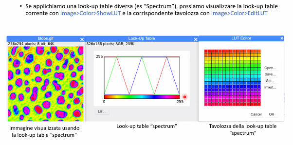
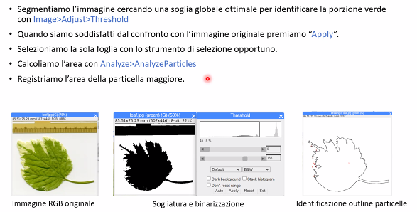

# Image J Seminar
Immagine:
- Rappresentqzione didimensionale secondo coordinate spaziali indipendenti di un'entità fisica relativa d un oggetto o a una scena
- Funcione di due o tre varibiali reali L(x,y) o L(x,y,z) dove L rappresenta l'entità fisica (es. intensità luminosa) di ciascun punto di un piano o di un volume di intersse identificato con coordinate x,y o x,y,z

Immagine digitale (definizione funzionale):
- Matrice di pizel quadrati or rettangolari organizzati in righe e colonne (matrice tridimensionale e voxel nel caso di immagini tridimensionali)

Image processing:
- Lo studio di qualsiasi algoritmo che ha come input un'immagine digitale e restituisce a sua volta un'immagine digitale o informazioni estratte dall'immagine originale
- Include le seguenti operazioni:
	- visualizzazione e stampa
	- editing e manipolazione di immagini (image editing)
	- correzione di immagini (image restoration)
	- miglioramento di immagini (image enhancement)
	- identificazione di caratteristiche di interesse (feature detection)
	- compressione di immagini (image compression)

Image formation: object in -> image out  	 
Image processing: image in -> image out		 
Image analysis: image in -> features out	 

Computer graphics: numeri in -> image out
Computer vision: image in -> interpretation out
Visualization: image in -> representation out

Un'immageine viene rappresentata come una matrice di pixel, dove ogni pixel è un numero che rappresenta un colore.

Perchè elaborare e analizzare immagini?
- Realizzare immagini accattivanti, efficaci, informative (image processing)
	- Pubblicazioni, presentazioni, siti web, social 
- Estrarre informazioni qualitative e quantitative da immagini (image analysis)
	- Misurazioni dimensionali, conteggi, livelli di attività
- Rendere possibili test e attività sperimentali (automation)
	- Sequenziamento genomico, identificazione di nuove galassie, automazione industriale, controllo di qualità di linea
- Adottare un approccio oggettivo e riproducibile (science)
	- Essenziale per un processo scientifico

Percezione umana e limiti:
Il nostro sistema visivo non vede tutto lo spettro elettromagnetico, ma solo una piccola parte (400-700 nm).

- Occorre quindi convertire segnali ottenuti tramite radiazioni elettromagnetiche non visibili all'occhio umano in rappresentazioni nello spettro del visibile.
- Perché è possibile analizzare immagini ottenute da segnali differenti dalle radiazioni elettromagnetiche

Perchè il sistema di visione e percezione umano non permette sempre valutazioni affidabili.
La retina include due fotorecettori:
- Coni: localizzati nella fovea, altamente sensibili al colore, non lavorano a bassi livelli di illuminazione 
- Bastoncelli: localizzati altrove, contribuisco alla percezione del contest, sono incapaci di distinguere il colore, lavorano anche a bassi livelli di illuminazioneIl sistema di visione e percezione umano non permette sempre valutazioni affidabili.

II segnale relativo all'intensità luminosa raccolta dai singoli fotorecettori deve venire elaborato (localmente e dal cervello) per bilanciare gli effetti dovuti ai tessuti sovrastanti che assorbono frazioni non trascurabili di luce.

Il sistema di visione e percezione umano:
- è limitato alle lunghezze d'onda comprese fra 380 e 700 nm, con una maggiore sensibilità intorno ai 550 nm;
- riesce a discriminare poco più di un centinaio di gradazioni di grigio (intensità luminosa);
- interpreta in maniera non lineare la relazione fra intensità della luce riflessa e l'intensità luminosa percepita di un oggetto;
- tende a sopravvalutare o sottovalutare le informazioni al confine fra oggetti di differente intensità (effetto Mach band);
- è influenzata dalla luminosità dello sfondo (effetto di contrasto simultaneo);
- La percezione del colore di un'oggetto è influenzata dal colore del contesto;
- Applica in maniera non controllabile algoritmi interpretativi e ricostruttivi dell'immagine.

L'intensità percepita non è una semplice funzione dell'intensità luminosa reale  

Esempio di acquisizione immagine

L'acquisizione permette di memorizzare l'immagine su supporto informatico (image digitization);
- II più piccolo elemento costituente l'immagine digitale è il «pixel» (picture-e/ement);
- I pixel contengono un unico valore, come in una cella di un foglio di calcolo;
I pixel vengono affiancati orizzontalmente e verticalmente come una sorta di mosaico.  

Viene stabilito:
- L'ordine in cui raccogliere e immagazzinare le infognazioni relative a ciascun pixel.
- Come archiviare l'informazione relativa a ciascun pixel.

Per aquisire un'immagine digitale sono necessarie due operazioni in sequenza:
- campionamento (sampling)
- quantizzazione (quantization)

Entrambi i passaggi eseguono una riduzione delle informazioni originali (analogiche e quindi appartenenti ad un continuum) in informazioni digitali, quindi necessariamente campionate e discretizzate.  
II processo comporta una perdita irreversibile di parte dell'informazione.  
L'operazione di campionamento è estremamente delicata e può portare a gravi errori di interpretazione (aliasing), in funzione della frequenza di campionamento (teorema del campionamento: $f_s \geq 2 B$).  
La catena di acqusizione digitale delle immagini

II CAMPIONAMENTO (Sampling) di una Immagine (2D) consiste nel suddividere l'immagine in tanti quadretti (pixel) come se si sovrapponesse una griglia.
- Intervallo di campionamento (distanza tra i punti)
- Tassellamento (disposizione geometrica dei pixel)
- II numero di pixel in cui si suddivide l'immagine definisce la risoluzione

Minore è il numero totale di pixel, minore è la risoluzione spaziale dell'immagine  
Un'immagine può essere ricampionata a minore risoluzione spaziale con perdita di informazione.  
L'immagine viene poi QUANTIZZATA, cioè si attribuisce un valore di intensità luminosa (ed eventualmente di colore) a ciascun pixel.

La quantizzazione converte l'immagine da una rappresentazione analogica continua ad una discreta attraverso i livelli di decisione o profondità $dk = 2^m$ (dk toni di grigio, m: numero di bit necessari a descrivere il tono di )grigio
- Se m = 8 consegue che dk= 256 (0-255)
- Se m = 12 ne consegue che dk= 212 = 4096 (0-4095)
- se m = 16 ne consegue che 216= 65536 (0-65535)
ADC: Analog to Digital Converter, definisce i livelli di decisione nel processo di quantizzazione del segnale analogico

La qualità complessiva di un'immagine digitale dipende perciò:
- dal processo di campionamento (spaziale)
	- numero di pixel
- dal processo di quantizzazione (profondità colore di toni di grigio)
	- bit di quantizzazione

Rappresentazione di un'immagine digitale:
- matrice di dimensione M x N di numeri interi

II rapporto di forma (aspect ratio)
- rappresenta il rapporto tra il numero di pixel in orizzontale e quello in verticale
(Nx/Ny).
- Un formato 4/3 vuol dire che il lato più corto è tre quarti del lato più lungo.
Formati più diffusi:

Dimensione dei file
- Dimensione di un file di immagine non compresso (es. bitmap) qualità fotografica a colori:
	- 1 colore 8-bit (256 toni di grigio)
	- 3 colori 24-bit (16 milioni di colori)
- Dimensione in bit:
[2000 x 3000]pixel x 8-bit a colore x 3 colori = 144.000.000 bit, pari a circa 17Mb.

Cio che vediamo sullo schermo, spesso non è tutta l'informazione contenuta nell'imagine!
I monitor dei computer gestiscono (generalmente) 256 livelli di grigio (8 bit)
- L'immagine RGB visualizzata presenta $256^3= 16777216$ colori (24-bit, true-color)
- Tale valore è, al più, quello che l'occhio umano può distinguere.
- Spesso le immagini scientifiche vengono acquisite usando 16-bit = 65536 livelli di grigio.
- Considerando i limiti dell'occhio umano, I monitor spesso mostrano meno dello 0,4% dell'informazione contenuta in una buona imagine digitale.

## Compressione delle immagini
File senza compressione: RAW, BMP
Gli algoritmi per la compressione delle immagini sono divisi in 2 famiglie:
- Compressione senza perdita (lossless): TIFF, PNG
- Compressione con perdita: JPEG, GIF
La compressione lossy può generare notevoli artefatti nei bordi netti.

Le immagini vengono in genere salvate in formato TIFF (.tif), compressione no lossy.
Non salvare in formato JPEG (.jpg) per usi metrologici!!!
- I valori nei pixel vengono notevolmente alterati.
- Utile solo per una visione qualitativa e per essere spedite via mail o per il web (formato molto leggero).
- E' possibile utilizzarle per analisi quantitative solamente quando l'informazione da estrarre è semplice o i dati disponibili sono sovrabbondanti (i.e. giorno o notte, persone o edifici, interni o esterni, risoluzione spaziale molto superiore rispetto alle dimensioni delle features di interesse...).

Elaborazione di immagini:  
Correzione dei difetti (Image restoration)
- mira a rimuovere o ridurre il degrado o la distorsione che un'immagine potrebbe aver subito durante l'acquisizione, la trasmissione o l'archiviazione.
- Tende a lavorare su porzioni di immagine con metodi generalmente lineari. E' un processo oggettivo. 

Miglioramento dell'immagine (Image enhancement)
- mira a migliorare la qualità visiva di un'immagine aumentandone il contrasto, la luminosita o la nitidezza.
- In genere agisce sull'intera immagine impiegando spesso metodi non lineari. E' un processo soggettivo.

## Convoluzione
La convoluzione è un'operazione matematica semplice in cui 2 matrici (l'immagine ed il kernel) producono come risultato una terza matrice.
- Consiste nei seguenti processi:
- Si sovrappone un kernel (o maschera) all'immagine
- Si moltiplicano i termini coincidenti
- Si sommano i risultati e si divide per il peso per $\sum_{i=1} k_{ij}$
- Si sposta il kernel al pixel successivo (su tutta la matrice immagine)

Tipi di kernel:  

## Correzione dei difetti (Image restoration)
Rappresenta la prima fase di processamento delle immagini al fine di ridurre i difetti dovuti
- Catena di acquisizione mal configurata
- Illuminazione non uniforme
- Alterazioni dovute alla prospettiva
- Altre fonti di segnale non ritenute utili
Tali correzioni sono comunque meno efficaci rispetto all'ottimizzazione dell'acquisizione dell'immagine nella finestra dinamica di interesse (decisa a priori adattando opportunamente la catena di acquisizione).

Elaborazione delle immagini per incrementare il rapporto segnale/rumore  
Dopo aver definito precisamente cosa si ritiene sia segnale e cosa rumore (ad es. polvere o graffi, presenti nell'immagine ma non correlati alla microstruttura).  
Generalmente disponibile nei sistemi di elaborazione d'immagine commerciali:
- convoluzioni,
- filtri matematici e morfologici
- Filtri logici o booleani
- analisi nel dominio delle frequenze (FTT e RTFTT)
Questa fase è delicata e richiede notevole esperienza da parte dell'operatore.

Spesso è necessario lavorare sul rapporto segnale/rumore, a causa di:
- Instabilità della sorgente luminosa,
- Bassa statistica di raccolta del segnale (es. basso dwell time),
- Amplificazioni eccessive del segnale durante l'elaborazione elettronica.

Un difetto comune nei microscopi elettronici è la presenza di disturbi puntuali dovuti all'instabilità della catena di acquisizione (l'immagine è costruita mediante una scansione di x,y segnali raccolti per un certo dwell-time, possono comparire pixel con
luminosità eccessivamente alta o bassa).  
Stesso difetto può manifestarsi su pellicole vecchie o nell'acquisizione di immagini con
sensori CCD con alcuni componenti difettati.  

Per risolvere il problema nel caso del SEM, in fase di acquisizione dell'immagine si può intervenire con acquisizioni ripetute della stessa area in cui segnali vengono integrati o mediati.  
Nelle fotocamere si può aumentare il tempo di esposizione.  
In entrambe i casi tuttavia si rischia di introdurre un nuovo difetto causato dal drift dell'immagine.  
Se l'immagine è già disponibile la procedura più semplice e comune è effettuare una media del valore dei grigi rispetto ai pixel vicini: neighborhood averaging:
- Consiste nel mediare la luminosità di una regione limitata di pixel confinanti, sommando le singole intensità e dividendo il totale per il numero di pixel (filtri Mean).
- Di contro, se non correttamente impiegato, la risoluzione laterale può essere compromessa a discapito dei particolari più piccoli (blurring o sfocatura).
- Si tratta di filtri lineari nel dominio dello spazio che non causano perdita di informazioni.

La regione di pixel in genere è quadrata il cui lato può avere dimensione variabile secondo la relazione 2m+1 (ossia solo numeri dispari): 3x3, 5x5, 7x7.  
La dimensione del kernel e i pesi vanno scelti in base alla dimensione degli elementi di interesse nell'immagine.

L'utilizzo del kernel coinvolge anche operazioni non lineari le cui procedure sono note come «neighborhood ranking» che può comportare una perdita parziale dei dati originali.
- Consiste nell'ordinare con un certo criterio l'intensità dei pixel adiacenti.
- II più noto è il filtro «Median» dove l'intensità del pixel centrale sarà dato dal valore mediano di quelli adiacenti.
- Rispetto ai filtri lineari (Mean) il kernel «Median» possiede geometrie diverse.

II filtro Median è particolarmente adatto a ridurre rumori detti di 'Shot noise' che coinvolgono il singolo pixel (corrotto o mancante).  
Si induce comunque una leggera distorsione o degrado dell'immagine.  

Nella distribuzione statistica dell'intensità luminosa di un gruppo di pixel adiacenti a quello da modificare è possibile utilizzare oltre alla media e alla mediana, la moda (filtri Mode).  
In questo caso la dimensione del kernel deve essere maggiore di 3x3 altrimenti la moda sarebbe scarsamente rappresentativa.

Un altro elemento di disturbo può essere l'illuminazione non uniforme che genera gradienti di luminosità nell'immagine, generati anche in trasmissione nel caso di campioni a spessore non omogeneo.  
Si può in genere minimizzare agendo sul setup dello strumento impiegando una illuminazione anulare (ottico), corretto allineamento del fascio (EM), ecc.  
In fase di post-processing si utilizza la tecnica del «Background subtraction».  
Ove possibile è utile acquisire una immagine dello sfondo e poi sottrarla all'originale eseguendo operazioni tra pixel spazialmente corrispondenti. 

Un'altra famiglia di filtri sono i filtri per l'aumento della nitidezza
Si tratta di filtri che incrementano il contrasto dei bordi distanziando il valore dei toni intermedi (es. toni di grigio) (filtri «Sharpening»)

## Image enhancement
Ha l'obiettivo di evidenziare una parte dell'immagine oppure solo alcune classi tra quelle utilizzate durante la quantizzazione.  
Nel dominio dello spazio, si applicano regole che coinvolgono il singolo pixel e/o quelli confinanti.  
L'applicazione più comune è la massimizzazione del contrasto (non comporta una perdita delle informazioni).  

I toni di grigio di una immagine vengono rappresentati con un istogramma che riporta il numero.  
di pixel rilevati per ciascun valore di tono di grigio.  
Esempio di istogrammi di una immagine troppo scura, troppo chiara e ben bilanciata.

La procedura per la massimizzazione del contrasto consiste nell'assegnare il tono nero al pixel più scuro rilevato e il tono bianco a quello più luminoso.  
Gli altri toni di grigio intermedi vengono linearmente interpolati.  
Importante è non avere problemi di 'Shot noise' che renderebbero vana la procedura (in tal caso è consigliabile prima applicare un filtro Median)

In generale la manipolazione dei toni di grigio di ciascun pixel avviene tramite una funzione di trasferimento che dipende dal tono stesso ma non dal valore dei pixel confinanti (come nella convoluzione).  
Tale funzione può essere lineare e non lineare al fine di enfatizzare un range di toni e appiattirne altri.  
Utilizzando funzioni di trasferimento con pendenza negativa l'immagine può essere invertita, come il negativo di una pellicola.  

Funzioni i trasferimento logaritmica e radice: comprimono la luminosità per i toni più chiari e la accentuano per i toni scuri.  
Funzioni i trasferimento esponenziale e quadratica: comprimono la luminosità per i toni più scusi e la accentuano per i toni chiari.

## Equalizzazione dell'istogramma  
Esistono tecnche avanzate di "Histogram mode/ing" che permettono di modificare in modo sofisticato il range dinamico e il contrasto dell'immagine in modo che l'istogramma dell'immagine elaborata abbia specifiche caratteristiche. Gli operatori di Histogram mode/ing possono impiegare funzioni di trasferimento non-lineari e anche non monotone.  
L'equalizzazione dell'istogramma impiega una funzione di trasferimento monotona non lineare che ridefinisce i valori di intensità dell'immagine in modo che l'immagine elaborata contenga una distribuzione uniforme di intensità (istogramma piatto).  

Trasformata di Fourier (FFT)  
Qualsiasi funzione periodica f(t) può essere scomposta nella somma di diverse
funzioni seno - coseno a frequenza crescente (serie di Fourier).
- 1-D FT: analisi di segnali (1-D)
- 2-D FT: analisi di immagini (2-D)

Eliminazione di una frequenz indesiderata  

Esempio di trasformate di Fourier per alcune immagini con elevata periodicità.  

Quando le immagini presentino informazioni periodiche da esaltare o eliminare, è utile lavorare nel dominio delle frequenze.  
Sono necessari i seguenti passaggi:
- Trasformazione nel dominio della frequenzao
- Filtraggio nel nuovo dominio
- Trasformazione inversa per tornare nel dominio dello spazio

Le basse frequenze corrispondono a graduali variazioni della luminosità dei pixel (superfici continue).  
Le alte frequenze corrispondono repentine variazioni dell'intensità dei pixel (spigoli, rumore, ecc.).

Applicazione della FFT per la rimozione del rumore: eliminazione del corrispondente spot luminoso nell'immagine della trasformata

## Segmentazione
Procedura ampiamente utilizzata per isolare nell'immagine solo le porzioni che contengono l'informazione desiderata (generalmente linee, curve, aree)  
II processo consiste nel classificare i pixel che hanno caratteristiche comuni (colore, intensità, texture).  
Le regioni individuate avranno quindi almeno una di tali caratteristiche differenti.  

Esistono diverse metodologie di segmentazione che si basano sulla elaborazione dell'istogramma dei toni di grigio secondo la logica di un 'descrittore':
- Classificazione dei pixel sulla base dei valori di intensità luminosa e applicazione di una soglia globale (**Thresholding e Binarizzazione**)
- Riconoscimento dei contorni (**edge detection**): si identificano le linee dove la luminosità cambia repentinamente.
- Raggruppamento (**clustering**): identifica aree di pixel aventi stesse caratteristiche in modo matematico (distanza euclidea e di colore, ecc.).
- Accrescimento delle aree (**Region growing**): parte da piccole aree di pixel di una regione dell'immagine e le accresce fino a coprire l'intera regione.

### Thresholding e Binarizzazione
- Consiste nel selezionare dall'immagine solo i pixel che hanno una luminosità inclasa in un range di toni di grigio prescelto.
- I pixel selezionati verranno convertiti con una luminosità a profondità binaria: ossia bianchi o neri.
- La scelta del range viene effettuata manualmente osservando l'immagine e agendo con software dedicati sull'istogramma dell'immagine.

La binarizzazione raramente produce subito risultati soddisfacenti a causa dell'illuminazione non uniforme o altre sorgenti di rumore.

II miglioramento delle immagini binarizzate viene effettuato processandole con 2 famiglie di filtri:
- Filtri booleani (comparazione e combinazione di più immagini)
- Filtri morfologici (modifica individuale dei pixel)
Combinare più immagini è utile nella manipolazione delle immagini SEM e delle mappe EDS dove ogni immagine contiene parte dell'informazione.

I filtri booleani sono operazioni logiche che combinano due immagini binarie (A e B) per produrre una terza immagine binaria (C).  

Filtri Morfologici
I filtri morfologici sono quelli più utilizzati tra cui si evidenziano:
- Erosion -> Opening
- Dilation -> Closing

Sono operatori che coinvolgono i pixel confinanti ma, essendo l'immagine binarizzata, le operazioni sono semplici (i pesi sono solo 1 o 0).  
Si ottiene l'aggiunta o l'eliminazione di pixel bianchi in base alla densità di quelli circondanti il pixel in oggetto, secondo determinate regole.  

**Erosion**  
La procedura rimuove i pixel bianchi isolati rispetto al numero di quelli bianchi che lo circondano, per eliminare i dettagli indesiderati a seguito della binarizzazione.  
**Dilation**  
Procedura inversa all'Erosion. Pixel bianchi vengono aggiunti attorno alle aree ad alta densità di pixel bianchi.  

Applicazione dei filtri Erosion e Dilation
- Isolamento delle sole fasi grigie tramite impiego in sequenza dei 2 filtri morfologici su una lega.

Filtro Opening: sequenza i operazioni ripetute di Erosion e Dilation al fine di separare i particolari di interesse:

Filtro Closing: sequenza di operazioni ripetute di Erosion e Dilation al fine di unire i particolari di interesse.  
es. fibre in cross-section con criccature.

## Premesse all'analisi quantitativa delle immagini
Significatività e affidabilità delle analisi.  

Per ottenere immagini che contengano informazioni misurabili è essenziale che il campione sia rappresentativo dell'universo osservato e che la catena di acquisizione sia in grado di raccogliere il massimo numero di informazioni necessarie (e il minimo numero di informazioni non necessarie o sbagliate).  

I software per l'analisi di immagine possono generare nuove informazioni, ma il livello di affidabilità delle informazioni create è direttamente dipendente dalla conoscenza del fenomeno reale che si sta investigando, e dalla qualità e quantità delle informazioni «reali» contenute nell'immagine elaborata.  

Questi sono elementi imprescindibili per tentare successivamente la costruzione di conoscenza per interpolazione, estrapolazione con la formulazione di modelli descrittivi e/o predittivi.

## Misura delle grandezze 
La prima ase consiste ne a ca i razione imensionae e immagine.  

E' necessario cioè riferire l'immagine ad un sistema di riferimento opportuno: dimensioni, geolocalizzazione, piano di proiezione, sistema di proiezione.  

Trascurando le trasformazioni più complesse (normalizzazione, ortonormalizzazione , planarizzazione , passaggio a coordinate polari...) il primo elemento fondamentale è quello di stabilire la scala dimensionale, e cioè i versori degli assi e il loro valore scalare rispetto ad una grandezza di riferimento.

Molti software di acquisizione eseguono automaticamente tale operazione, laddove la catena di misura è fissa e il software è in dotazione con la catena di acquisizione.

Altre volte è necessario calibrare la catena di misura.

E' comunque buona norma verificare sempre la corretta calibrazione, soprattutto laddove sia richiesto un elevato livello di precisione e accuratezza.

Anche nei casi più semplici (rappresentazione cartesiana) è opportuno eseguire la calibrazione comunque per entrambi gli assi.

In alcune circostanze e laddove si è consapevoli di errori sistematici (i.e. aberrazioni sferiche delle lenti, oppure sistemi di acquisizione con fattori di ingrandimento non costanti su tutto il campo di osservazione) è indispensabile trovare la funzione di trasferimento per calibrare l'immagine, altrimenti segmenti di uguali dimensioni in zone diverse dell'immagine possono fornire dati falsati.

Un errore classico è quello di considerare il piano immagine come una proiezione piana parallela al piano oggetto.

Questo può portare a gravi errori nel caso di sezioni inclinate rispetto all'asse ottico di acquisizione dell'immagine, fortunatamente sistematico e quindi facilmente rettificabile.

Procedura piu elementare di calibrazione per un ottico:
1. Viene acquisita l'immagine di uno standard (oggetto graduato)
2. Si estrapola la dimensione del singolo pixel (gm/ pix , spesso rettangolare!)
3. Tale dimensione (in x e in y) viene utilizzata per calibrare le immagini che verranno prodotte da quella determinata catena di misura (i.e. con lo stesso sistema ottico).

Sull'immagine calibrata si possono effettuare tutte le misure di interesse 

L'immagine calibrata si riconosce perché porta sovraimpressa la dima o barra dimensionale.

Attenzione va posta nell'inserire una dima bidimensionale su un'immagine prospettica o con grande tridimensionalità.

Le misure prese sulle immagini saranno una parte di tutti i valori misurabili in quel campo di osservazione, che è una parte della superficie osservabile del campione, che a sua volta è una porzione del materiale che stiamo studiando.  

Non dobbiamo mai dimenticare che a questi valori va sempre data una significatività statistica.

E' prassi classificare i dati ottenuti e generare dei grafici di dispersione che meglio descrivano il comportamento statistico delle grandezze osservate, passando ove il caso a test statistici di significatività (t di student , chi quadro, ecc).  

Quanto più numerosi sono i dati e le classi, tanto più il grafico approssima una curva continua, la cosiddetta " curva di frequenza".

# ImageJ

Image > Type seleziona i bit per pixel dell'immagine (8, 16, 32 bit)  

Analyze: per estrarre l'informazione di interesse dall'immagine.  

Analyze > Histogram: genera un istogramma dell'immagine. Applicando Log reisco ad amplificare i valori più bassi.  
Se l'istogramma va a 0 per un buon range di valori, significa che l'immagine non sfrutta tutto il range di valori disponibili.  
Enhance contrast: settando 0% e normalizzando l'immagine si schiarisce leggermente e l'istogramma si distribuisce meglio su tutti i livelli. I valori intermedi sono interpolati.  

L'asse x dell'istogramma mostra il numero di bit del convertitore analogico digitale

Mettendo 0%, in questo caso la normalizzazione non è servita
Mettendo 5% e normalizzando l'immagine si schiarisce leggermente e l'istogramma si distribuisce meglio su tutti i livelli. I valori intermedi sono interpolati.  
Abbiamo acquisito informazione perché abbiamo scoperto una parte dell'immagine che non era visibile prima ma abbiamo perso in definizione.  

L'equalizzazione crea una funzione di trasferimento monotona non lineare ottimizzata per questa specifica immagine in cui si cerca di avere una distribuzione uniforme dei livelli di grigio.  
Questo permette di creare contrasto dove non c'è e non esagerare dove c'è già.   
Ad esempio riusciamo a distinguere il grigio anche all'interno della galassia.  

---
Image > Adjust > Brightness/Contrast: permette di regolare il contrasto e la luminosità dell'immagine.  

La retta indica le attuali impostazioni della funzione di trasferimento che di base è un'identità.  
La Brightness tende ad aggiungere un offset comune tutti i livelli di grigio (+Brightness -> +Offset, -Brightness -> -Offset).  
Il Contrast tende ad aumentare la pendenza della funzione di trasferimento (+Contrast -> +Pendenza, -Contrast -> -Pendenza).  

---
Aumentando il minimo e riducendo il massimo si aumenta il contrasto senza cambiare la pendenza della retta -> senza perdere informazione.  

## RGB images
1/3 mostra il numero del canale (Rosso).  
512x512 shows the image size.  
8-bit shows the color depth of each color channel.  
768k shows the image size in bytes.  
The bottom bar shows the three color channels.  
White = R + G + B.  

Image > Type > 8-bit: converts the image in grayscale.  

The image has a red fluorescence which is captured with a RGB camera, then the green and blue channels are empty.   
The red channel can be easily converted into a grayscale image by selecting Image > Type > 8-bit.  

We can directly obtain the grayscale image by selecting Image > Color > Grayscale even if the image is RGB.   
The resulting image is much more dark than the previous one since the coordinates of each pixel are averaged by 1/3 red + 1/3 green + 1/3 blue. In this case green and blue are black so the resulting image is much more dark.  
We can adjust the brightness and contrast of the image by selecting Image > Adjust > Brightness/Contrast.  
Its histogram is concentrated in the low values of the grayscale.  

The left histogram doesn't cover the whole range of the grayscale since we have only stretched the histogram by adjusting the brightness and contrast. It has a lot of zeros since the values are interpolated only where there are values, if there are zeros they remain zeros.  
The right histogram covers the whole range of the grayscale and has much more less zeros since the values are interpolated everywhere.  
Converting an RGB into a 8-bit grayscale image generates a loss of information.

## Look up table
Image > Color > Show LUT
The look up table only converts the image visualization, not the pixel values.  
The graph shows the correlation between the bit 

The histogram has great peaks at low values of the grayscale while the image is not so dark.  
This is due to the fact that the image is saved as an inverted LUT. The histogram was correct but the image was inverted.  

EditLUT allows to modify how a color should be displayed

To make some measurements, the image has to be calibrated.  

## Segmentazione
Mettiamo a 1 o a 0 i pixel in base al valore di soglia.  
Image > Adjust > Threshold: permette di selezionare il valore di soglia.  

## Conteggio particelle

By making the ratio between area of different gray levels we can get the percentage of the colors in an area.  

## Erosion and dilation

## Segmentazione immagini a colori

## Correzione shot noise

Process > Smooth non è molto efficace.  
Process > Filters > Mean con raggio 2 non è molto efficace.  
Process > Filters > Mean con raggio 5 è efficace ma c'è molto blurring tra le zone bianche e nere.  
Process > Filters > Median con raggio è efficace e non c'è blurring tra le zone bianche e nere. Questo filtro non è lineare . 

## Filtraggio in frequenza
Il grafico mostra uno sfondo non uniforme, tende lentamente al bianco da sinistra verso destra.  

Usando un filtro passa basso si ottiene un'immagine più uniforme.  
Mettendo 200 pixels in "filter large structures down to" filtriamo tutte le strutture più piccole di 200 pixels.  

## FFT 

## Edge detection

Il watershed applicato a immagini binarizzate funziona solo per maschere convesse

